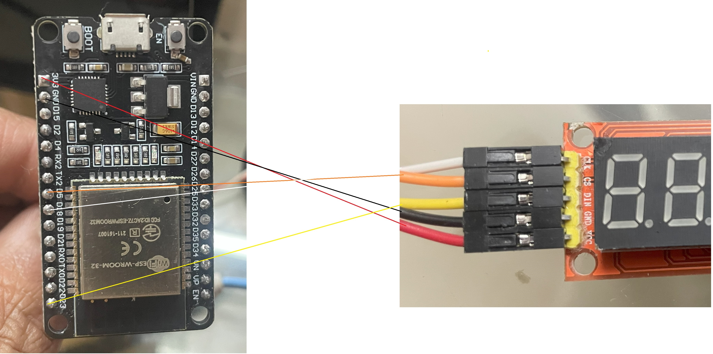

# Real Time Internet Clock Display using ESP32 and MAX7219 8 Digit Led Tube Display Control Module

- ESP32 board used is https://www.amazon.in/dp/B071XP56LM?ref=ppx_yo2ov_dt_b_fed_asin_title (ESP-WROOM-32)
- Led Module used is https://robu.in/product/max7219-8-digit-led-tube-display-control-module/
- I use vscode with platform io for programming ESP32, hence the folder strucure and filenames are different in uploaded code
- LedControl library had to be slighly tweaked to make it work ESP32. The modified version is uploaded here

## Wiring

(IMG_4276.jpg)