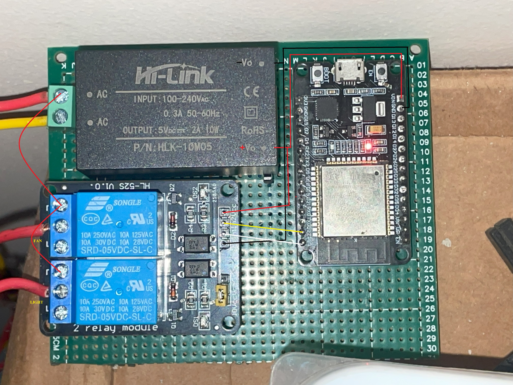

## Wiring


## in Arduino Cloud
in https://app.arduino.cc/ Create ```thing``` with variable ```CloudSwitch officelight;``` and ```CloudSwitch officefan;```. Add esp32 device as ```DOIT ESP32 DEVKIT V1```
